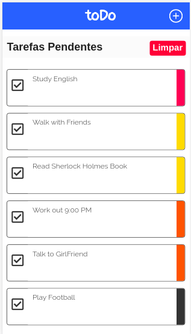

# toDoApp

This a app done by me with the main goal to store my the things that I need to do in the day, It's done with HTML, CSS and JS.

# How use

Please access the app with a resolution of 768px of screen width! Cause the version of the screens of bigger size than 768px is not already!

**How Can I Do It?** 

*Windows & Linux:* ``Ctrl + Shift + M``

*Mac:*  ``Cmd + Shift + M``

After this if it is still not working fine! Please move your mouse to the top-center of your screen and at left you will find a drop-down box, click on that choose any device from Moto G4 to Ipad! 

## Technic Explanation

In the side of HTML, CSS it's a little bit easy to undestrand cause I didn't used a lot of logic.
In JS side it was a little bit tricky it'll depend of your understanding of JS and your experience a really hope that you understand, bellow I describe exactly how I did it!

## My approach for the problem

I has been studying data stucture and I learned some new stuffs and at this point I tryied to implement something with this knowledge and I did it, implementing it in this app using a type of Ordered BQueue where the less priority is 1 and the highest is 4, and each to-do in the to-do-list needs has this priority! And it will be append at the end or in begin(if the subqueue is empty) of the subqueue of itens with the same priority and you have 2 options to deal with a to-do item and these are the edit option and delete option! With edit option you can change the title of to do and the priority of the task and with delete option we can delete each to-do individually without changing the other to-do itens, and you also have the opportunity to clean up the list of the itens to be done and also the itens already done!
  
## Layout Project

### First Screen

## Adding To Do

## To Do List view

## Deleting To Do

## Updating To Do

## Undo Task

